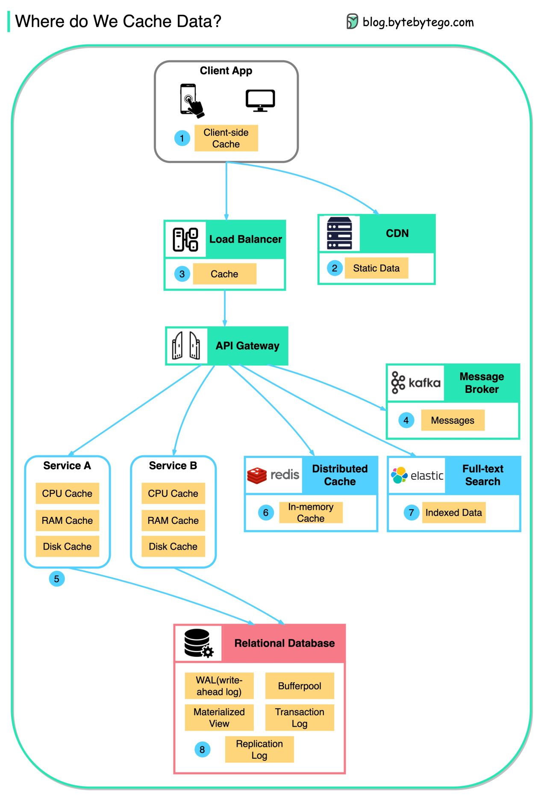

## Use case

0. (client ) HTTP cache: E-tags & Cache-Control control (max-age), expires, , fingerprinting or versioning for cache busting

1. Load Balancer: The load Balancer can cache resources as well.

2. Distributed Cache: redis, memcache.,.l,.....l.,,,v c sdxzz

3. cdn [🔗](/SystemDesign/cdn%20%26%20proxy%20%26%20api%20getaway.md)

4. kafka (message):  Message brokers store messages on disk first, and then consumers retrieve them in memory

5. db
- WAL(Write-ahead Log): data is written to WAL first before building the B tree index, more on [write-ahead.md](write-ahead.md).
- Bufferpool: A memory area allocated to cache query results
- Materialized View: Pre-compute query results and store them in the database tables for better query performance
- Transaction log: record all the transactions and database updates
- Replication Log: used to record the replication state in a database cluster

## technique

1. LRU
2. LFU
3. TTL

## distributed cache

[link](https://www.alachisoft.com/resources/articles/readthru-writethru-writebehind.html)

***Cache-aside (synchronized)***:  The cache is "kept aside" as a faster and more scalable in-memory data store.

read: 1) checks cache

write: 1) update memory 2) update cache

-> read-heavy workloads: Memcached and Redis

***Read-through/Write-through (read heavy with first time loading )***: store and reads / writes data to cache. The cache is responsible for reading and writing this data to the database

read: 1) checks cache

write: 1) update cache  2) update memory

-> Better read scalability with Read-through

-> Better write performance with Write-behind, schedule the database writes

-> Solution to first time loading: ‘warming’ or ‘pre-heating’ the cache

Write-through:
- pro: consistency (simultaneously updated to cache and memory), helps in data recovery
- cons:

Write-back / Write-behind:
- pro:  less memory access (updated into the memory at a later time with batch job), use "Dirty Bit" to indicate if the data present in the cache was modified(Dirty) or not modified(Clean).
- cons: can be inconsist if Cache fails
