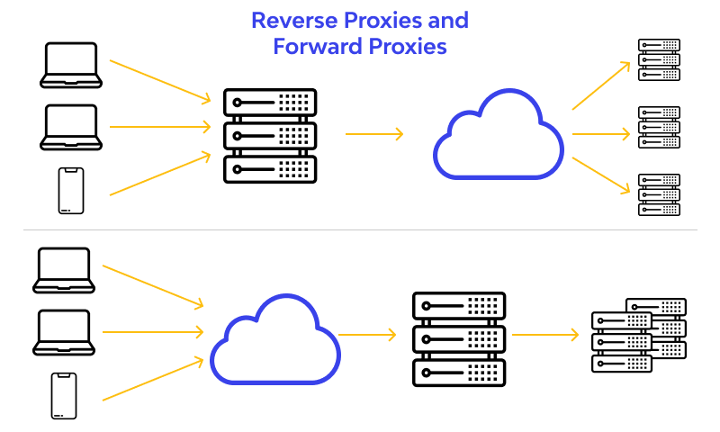
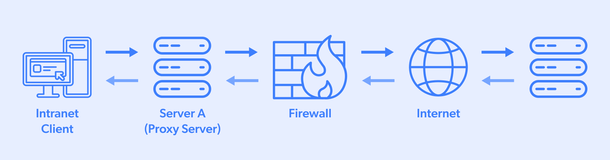
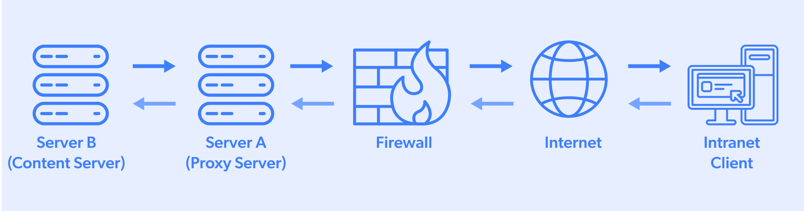

[youtube](https://www.youtube.com/watch?v=RI9np1LWzqw)

---

1. [cdn](#cdn)
2. [proxy](#reverse-proxy)
3. [api getaway](#api-getaway)

---

### CDN

Features:
- improve performance
- security (DDoS, single point failure)
- compress on-the-fly (optimize formats, e.g: PNG to Webp)
- TLS handshake terminate at the edge (reduce latency)

Routing:
- DNS 
- reverse proxy

### Forward Proxy

- bypass browsing restriction (bypass firewalls after authentication)

### Reverse Proxy

[link](https://www.wallarm.com/what/what-is-the-reverse-proxy)

- server load balance
- blocks access, public / private data
- avoid DDoS gaining access (ip address exposed to reverse proxy)
- divide load
- SSL

### API getaway
