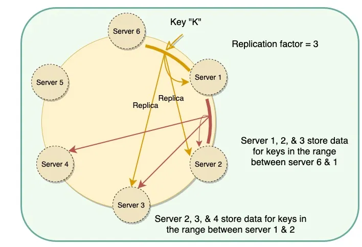

https://interviewnoodle.com/how-to-use-consistent-hashing-in-a-system-design-interview-b738be3a1ae3

# Consistent Hashing maps data to physical nodes and ensures that only a small set of keys move when servers are added or removed.

1. md5 hashing of key
2. avoid hotspot: hash range is divided into multiple smaller ranges, and each physical node is assigned several of these smaller ranges.

Problems with manual and fixed division of the ranges:
- computation needs when add/remove
- hotspot
- rebuild burden on replica

Solution - Vnode:
## the hash range is divided into multiple smaller ranges, and each physical node is assigned several of these smaller ranges. Each of these subranges is considered a Vnode.
- easier to add/remove, speeds up the rebalancing process
- smaller range:  decreases the probability of hotspots.

Each physical node is assigned a set of Vnodes, and each Vnode is replicated > once.

