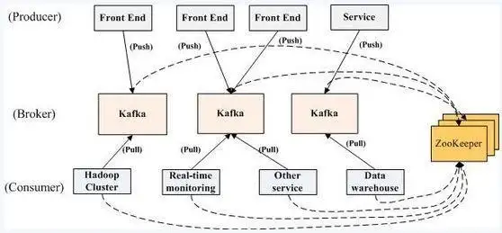

[link](https://aws.plainenglish.io/apache-kafka-system-architecture-cc74e7d47904)

Kafka: distributed, publish/subscribe messaging system

## features

1. message persistence in `O(1)` time complexity

2. high throughput `100k per second`

3. ensuring the sequential transmission of messages 

4. support online horizontal expansion

5. `ZooKeeper` coordinate and forward the requests 

## funtions

1) publish message +  subscription message

2) interdiate storage array

3) broker: grouped to manage performance

4) topics: patition across system, running in parallel to multiple consumer groups

5) partition: replicate topics for limit on fault tolerance. message has sequence ID to know the sequential order

6) producer (configurations on ): transmit data to right/round-robin partition ).

    - configurations: ****acks (ack = 0 .. all = -1 ) for no number of acks required from replicas, retries, batch size, send machanism (fire and forget, sync, async)****

    - trade-off: consistency and throughput
 

7) consumer: subscribe to partition with load balance

    - configurations: read time (one, at least one, at most one), auto vs. manual commit, offset strategy, heartbeat to broker, replicas of partition among brokers

8) stram workflow by *ROCKS DB*

9) Zookeeper: maintain metadata for all brokers, topics, partitions, and replicas, notify broker fail, store offset of consumer

## Usage Scenario

Log Collection

Message System

User Activity Tracking

Operational Indicators

Streaming