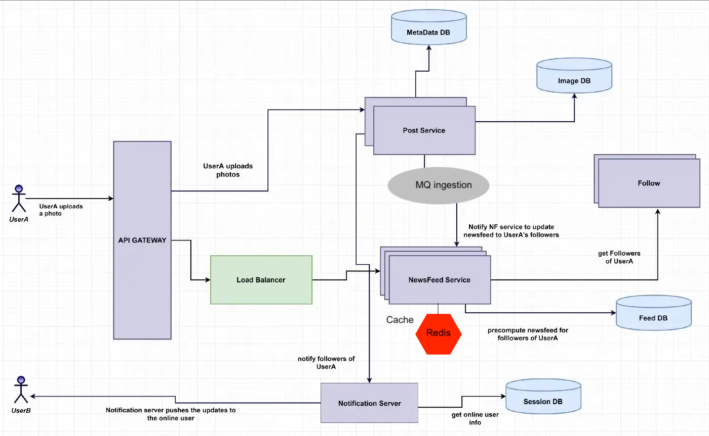

[link](https://towardsdatascience.com/system-design-analysis-of-instagram-51cd25093971)


Functional requirement:
- read, search
- upload
- follow
- display feed

Non func:
- available over consistency
- low latency (200ms on home page)
- reliable

Data flow:
```
Table Name : table indexe1,index2 etc

Photo: PhotoID (pk), UserID, PhotoLocation, CreationDate

User: UserID(pk), Name, Email, DOB, LastLoginTime

Follow: UserID1, UserID2 (paired pk)

FeedItem: FeedID(pk), UserID,Contents, PhotoID,CreationDate

**pk = primary key
```

Push / Pull:
hotkey vs. active user
