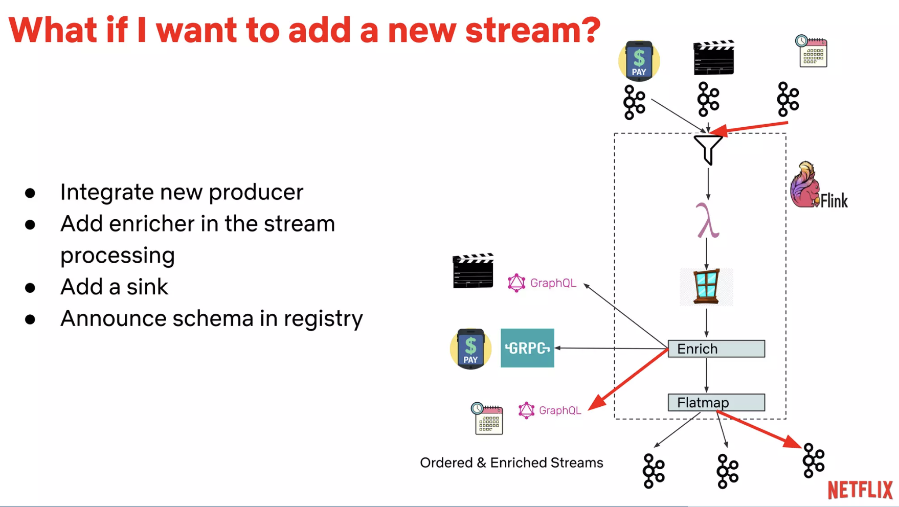

[Business logic](https://www.geeksforgeeks.org/system-design-netflix-a-complete-architecture/) [🔗](#business-logic)

[RAM and SSDs for caching](https://netflixtechblog.com/evolution-of-application-data-caching-from-ram-to-ssd-a33d6fa7a690) [🔗](#ram-and-ssd)

# Business logic

Like/share/subscribe

Watch time

Video title/labels/categories

Freshness

## Billing

MySQL (for ACID compliance)
2 master - "Synchronous replication protocol” :
- both primary and remote master confirm on write

- read replica are located in multiple node: local and cross-region

## Viewing history

NoSQL (Cassandra):

viewing history
shard based on recency:
= Live Viewing History : small number of recent viewing historical data of users with frequent updates

Compressed Viewing History: A large amount of older viewing records

# Logging and Event search
Elastic Search: data visualization, customer support, and for some error detection in the system

# Data Processing
1) Apache Chukwe = batch processing: Chukwe writes the event in the Hadoop file sequence format (S3).  then writes Hive in Parquet data format.

2) Kafka: upload online events to S3, Elasticsearch, and secondary Kafka.

# Recommendation model + ranking
#### model:
- content-based filtering:  classification-based or item-item collaborative filtering
- Collaborative filtering: user-user collaborative filtering

#### ranking: use offline + online
- offline:  calculate similar users/videos are also running regularly

- online: based on the user profile and his actions

combine and do ranking on the fly

# RAM and SSD
store the hot data in RAM and cold data on disk

https://www.softkraft.co/apache-kafka-use-cases/

# Event streaming with Kafka

[reference](https://www.slideshare.net/ConfluentInc/eventing-things-a-netflix-original-nitin-sharma-netflix-kafka-summit-sf-2019-179806392)

event centric data processing:

use ***Flink and Kafka*** for streaming processing, and build search index with elastic

Kafka:
F(id, entity) with calling to Entity API with ID

Schema: UUID, entity id (stored in graphQL), ts, type, payload

add new schema: add enricherm sink, announce schema in registry

