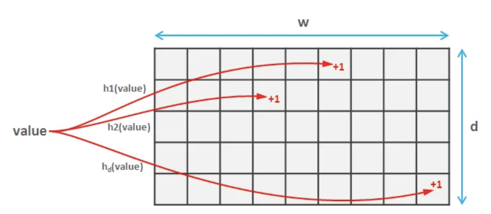

## key topics:
### hashtag with timestamped event ID, fast & slow approach

event id: SnowflakeID timestamp embedded id

### storage needs:
ID + 7 character = 120 bits = 800 billion * 120 bits = 10 tb

can be filled in a Cassandra instance

### slow approach:

MySQL

(hashtag, frequency, datetime)

partition the data by hashtag

if each instance has 2GB data, with  100MB/s read speed, 20 seconds is needed

### fast approach

Redis hash-map

## other counting methods

- Min-Heap priority queue of size K i.e. it stores the K most frequent hashtags

- Count Min Sketch

With d=10 hash functions and w=2000, we can obtain an error rate of only 0.1% (sum of all frequencies) with a confidence bound of 99.9%

