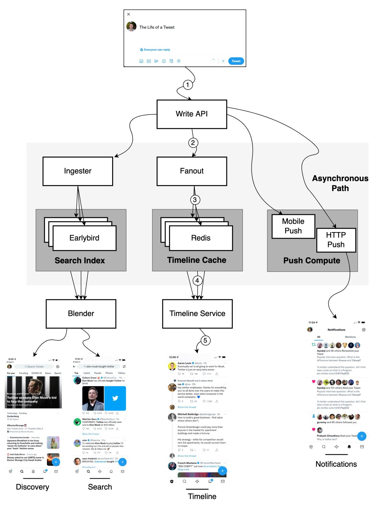
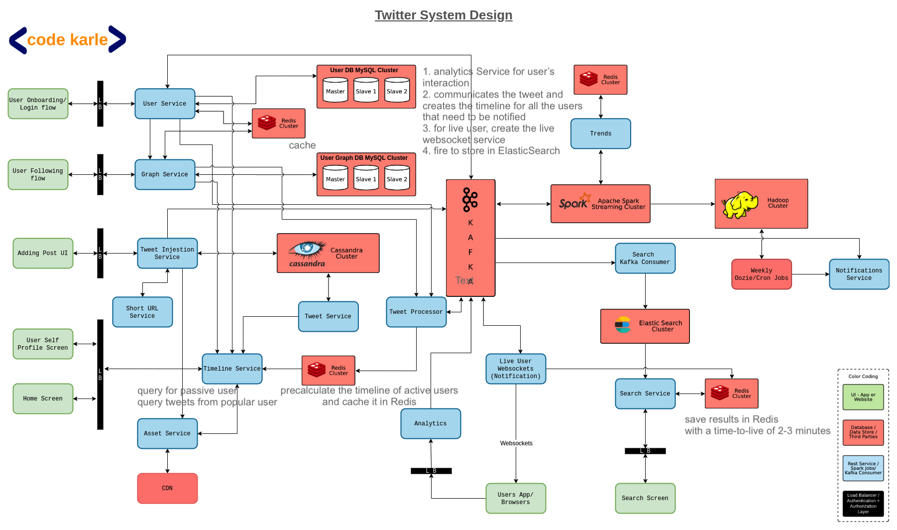

[link](https://www.pankajtanwar.in/blog/how-twitter-stores-500m-tweets-a-day)

[link](https://www.infoq.com/presentations/Twitter-Timeline-Scalability/)

0. [Service](#service)
1. [Database](#database)

# Service

[reference](https://www.codekarle.com/system-design/Twitter-system-design.html)

Kafka: process injected tweet, fire events to
1) ***tweet processor + redis*** -> which will cache active user's tweet
2) analytics & offline notification data using ***spark + hadoop***
3) ***elastic search***

Redis: cache tweet, user, trending topic info

Cassandra: process incoming tweets and provide data to timeline service upon query (due to  Columnar DB with partition key, and defined query)

# Database

1. load balance is not efficient since temporal sharding will make old machines has way less traffic

2. expansion

MySQL - MySQL doesnot work for ID generation and graph storage. They use MySQL for smaller dataset of < = 1.5TB and as a permanent backing store for large datasets

Cassandra - Its used for high velocity writes and medium-low velocity reads. Another advantages are easy cluster expansion,can run on cheap and simple hardware than MySQL & schema less design is a major plus.

Hadoop - Twitter uses hadoop internally for unstructured and large dataset (~100s of billions of rows eg. http logs). The major advantage is its massive horizontally scalability & redundancy.

### end to end encryption:
- encryped any user's public key:

    can ONLY be decryed by private key

    can not be decrypted by same public key

- encryped any user's private key:

    can be verified by the public key
