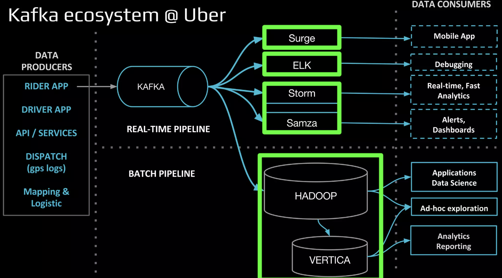
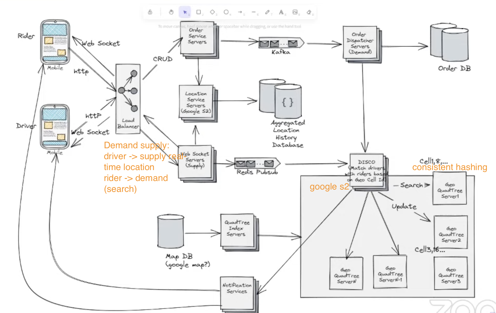

 https://eng.uber.com/cherami/

1. [Real time data analysis](#real-time-data-analysis): [link](https://www.slideshare.net/AnkurBansal50/uber-real-time-data-analytics)

 # Real time data analysis

Requirements:
- qps: 1 trillion
- throughput: 100TB -> PB
- reliability: 99.9%
- low latency
- multi-language
- reliable replication

## clusters
async user data
logging
time sensitive data - low latency (e.g: surging, push )
high value -at least once, sync- (e.g: pament)

Solution:
1. add secondary fallback

## kafka REST proxy
- multi-language support
- reliability

## Kafka Ack
For high throughput:
- batching
- ack before produce (ack'ed != committed)

Solution:
- use 2 cluster in broker (`min.insync.replicas = 2`)
- wait till leader come back (`unclear.leader.election = false`)

https://engineering.linkedin.com/kafka/benchmarking-apache-kafka-2-million-writes-second-three-cheap-machines

kafka:
* persistent - messages are immediately written to the filesystem when they are received.
* high throughput - 2 m qps, Kafka topic is just a sharded write-ahead log. Producers append records to these logs
* durability: central queue for consumers, space-efficient, buffer TBs of unconsumed data
* fault-tolerance: replicates its logs over multiple servers
* garantee delivery: Producers get an acknowledgement back when publish, Consumers saves position in a log by committing periodically

https://doordash.engineering/2023/02/22/how-doordash-designed-a-successful-write-heavy-scalable-and-reliable-inventory-platform/

Fine tune

High Scalability:
- Frequent updates: batch upsert
- time-to-live for fast-growing tables

High Reliability
- raw data feed upload to db
- Retry
- Heartbeat from worker

Low Latency: time-sensitive
- a natural primary key for query instead of auto-incrementing a primary key => multi-column primary keys. e.g: (username, post_timestamp)

High Observability: detailed and historical item-level
- processing details are passed on to a Kafka layer

https://towardsdatascience.com/ace-the-system-design-interview-uber-lyft-7e4c212734b3

https://leetcode.com/discuss/interview-question/1064199/uber-front-end-phone-screen-reject