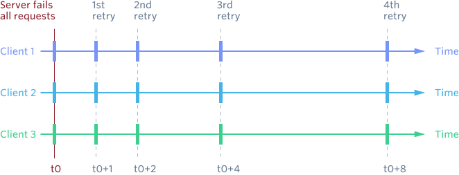

https://1o24bbs.com/t/topic/26890/7

https://1o24bbs.com/t/airbnb-interview-question-collection/6802

### scale:

read / write seperate -> master / slave -> caching (inconsistency) -> client side computing -> denomalize db  -> periodically prematerialize the most complex queries and try to stop joining in most cases -> drop secondary indexes and triggers

### quick write:
- write-thorugh cache
- async replication

### read availability:
- failover to alternative

### server fail

- expotential backup
- add "jitter" for randomness "thundering herd problem."
a large number of processes or threads waiting for an event are awoken when that event occurs, but only one process is able to handle the event.

## exactly-once:
[idempotency](./idempotentcy.md)

### write heavy:
redis on top of Cassandra

- Apache Helix: a robust cluster management framework that works on top of ZooKeeper
- allowing defining custom topologies and rebalancing algorithms
- uses ZooKeeper for monitoring of connected workers and propagating sharding state information change

Redis & Apache Cassandra (replication & storage):
- Cassandra is a durable and cross region replicated storage
- Redis was used as a capacity cache on top of Cassandra to avoid thundering herd problems commonly associated with the sharded systems on deployments or failover events.
