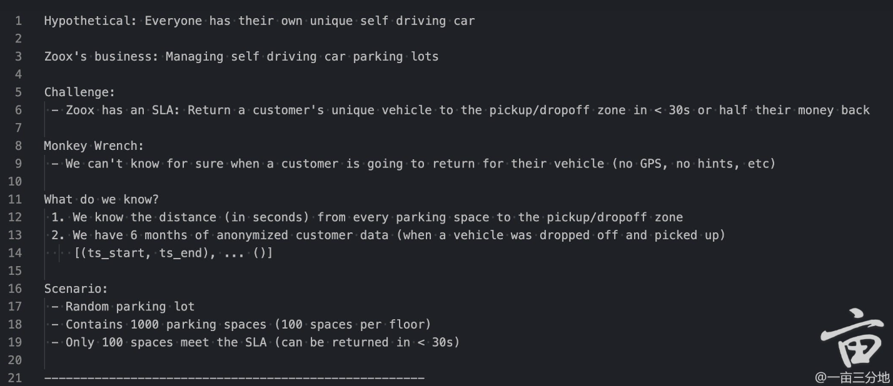

Each airline contains its own cost requirements. Ultimately, the airline is only interested in two major components: the space you take on the plane, and the distance you fly. You must generate ticket costs using this gathered data:
Airlines: United, Delta, Southwest, LuigiAir
Operating Costs:
- Economy:  No charge
- Premium:  $25
- Business: $50 + $0.25/mile

Per-Airline Prices:
- Delta charges $0.50/mile
   + OperatingCost
- United charges $0.75/mile
   + OperatingCost
   + $0.10/mile for Premium seats
- Southwest charges $1.00/mile
- LuigiAir charges $100 or 2 * OperatingCost, whichever is higher
Keep in mind that, while there are only four airlines listed above, your solution should be able to expand to dozens of individual airlines,  whose ticket cost can be based on arbitrary functions of "Operating Costs", miles, and/or seating class.
Example Input:
-------------------------------------------
United 150.0 Premium
Delta 60.0 Business
Southwest 1000.0 Economy
LuigiAir 50.0 Business
-------------------------------------------
Example Output:
-------------------------------------------
152.50
95.00
1000.00
125.00
-------------------------------------------
Explanation of Output:
-------------------------------------------
152.50      (150.0 * (0.75 + 0.10) + 25)
95.00       (60.0 * (0.50 + 0.25) + 50)
1000.00     (1000.0 * 1.00)
125.00      (100 <= 2 * (50 + 50 * 0.25))
---------------------------------‍‍‌‌‌‍‌‍‍‍‍‌‌‍‍‍‌----------
'''
test_input = [
    "United 150.0 Premium",
    "Delta 60.0 Business",
    "Southwest 1000.0 Economy",
    "LuigiAir 50.0 Business"
]

https://www.1point3acres.com/bbs/thread-928464-1-1.html

https://www.1point3acres.com/bbs/thread-928464-1-1.html

Best Time to Buy and Sell Stock

第三轮是系统设计，假设zoox外面有很多车，每时每刻在上报自己的坐标，如何做一个网页地图工具，能实时显示车辆的位置，答的很差，因为没有任何domain knowledge, 我只能按照系统设计里的东西，叠床架屋，把load balancer, message queue等能用上的都用上，实际上我自己都觉得我在说胡话，面试官看着也是放弃治疗的样子，什么提示也不给，等我表演完就结束面试了，跟第二轮里的面试官小姐姐完全不同，这一轮面试官完全全程沉默，话很少，没啥互动，跟第二轮的面试官小姐姐风格完全不同。

parallel计算股票买卖

design：设计数据库存储id和邮箱，会问一些比较偏实践的问题，类似如何增加一个field以及，如何在使用‍‍‌‌‌‍‌‍‍‍‍‌‌‍‍‍‌过程中backfill别的数据

类似4 sum的题，还有一道events的题，面经都有

Python interview question，过了一遍，结果发现面试官可能也是同一个网站找的面试题。
2. 写一个计算机票价格的OOD，有基本计算方法，以及不同航空公司的特殊因素。要求支持加入更多航空公司和规则。这个逻辑就是典型的继承。注意singleton，不要每次创建一个新对象。

https://www.1point3acres.com/bbs/thread-854340-1-1.html

abstract class, override, factory pattern

https://www.1point3acres.com/bbs/thread-738252-1-1.html

https://www.1point3acres.com/bbs/thread-928464-1-1.html

https://www.1point3acres.com/bbs/thread-854340-1-1.html

- 先是两道题（Q1、Q2）：计算加速度、判断题目中的加速度是否是comfortable的加速度；然后是4道连贯的代码题，大概是：给两个车，已知其中一车的速度，Q3、Q4 计算另一车（已知开始时车距、速度）需要的车距，使得最后实现与前达到1.5s的跟车距离Q5还给了你一个已经写好的input是速度和目前车距的PID distanceController，返回加速度，让你在主函数里用它simulate 10s来实现前一问的1.5s的跟车距离，总之就是用高中物理知识把两车的速度、加速度、位移算对就行了；Q6 是给了3辆车相对于自己这辆车坐标系的x和y值，以及path（道路的形状）这个多项式二次函数的三个系数、车道的宽度，让你计算跟三辆车中的哪一辆。

重头戏：写一个image processing的pipeline。最好用factory pattern，Lambda function或者用std::bind构造functor，要是只用if else估计会挂。
OnSite：
LeetCode 136: Single Number
LeetCode 137: Single Number II （构造法，circuit design）
LeetCode 260: Single Number III（没考过但是和前面有关联的）
LeetCode 200: Number of Islands （Union find）
LeetCode 206: Reverse Linked List（Follow up：A linked list can be reversed either iteratively or recursively. Could you implement both?）
LeetCode 226: Invert Binary Tree（没考过但是和前面有关联的）
LeetCode 121: Best Time to Buy and Sell Stock （Follow up：如何多台电脑并行计算提高效率？答案：平分数据块，对于每一个数据块，用同样算法找出最优买点，最优卖点，以及全局最低和全局最高这四个数，该数据块可以总结为这四个关键数字，注意出现顺序不能改变。最后把这四个数全部拼起来再跑一次原算法。）
LeetCode 122: Best Time to Buy and Sell Stock II （没考过但是和前面有关联的）
LeetCode 53: Maximum Subarray（Follow up：如何多台电脑并行计算提高效率）
LeetCode 931: Minimum Falling Path Sum（Follow up：如何多台电脑并行计算提高效率？答：只能两台电脑，一个从上往下扫，一个从下往上扫，中间汇合再处理一下）
LeetCode 64: Minimum Path Sum（Follow up：有负数怎么办？）
LeetCode 4: Median of Two Sorted Arrays
Disjoint-set, shortest path (Dijkstra, Floyd)
LeetCode 48: Rotate Image
写一个循环buffer，只能用‍‍‌‌‌‍‌‍‍‍‍‌‌‍‍‍‌array和pointer
如何判断点在多边形内部还是外部？（射线法，向量法）

物理，数学：
给出hexagon（正六边形）的面积求边长
为什么夏天比冬天热?（阳光入射角）
给出大小球半径比r，求重量比
1TB的硬盘存1920*1080的视频， 30帧每秒，能存多少分钟？
游泳池里坐船上往水里扔石头(ρ>1000)，水平面上升还是下降？(下降)
1000块钱投资，每年100%收益，估算20年之后多少钱？
有一个六面骰子和一个八面骰子，从中随机选一个然后丢出3的概率？（7/48）已知丢出来的是3，求骰子是六面骰子的概率？（4/7）再把这个骰子丢一次，丢出来的数字期望？
求黑色星期五（13日同时是星期五）的概率？（费马小定理）
三维tic tac toe, 多少种赢法（49）
求空间里点到平面的距离
估算地月距离？（观察法，万有引力）
给定一列无序的n个数，找最大值的过程中max变量被赋值次数的期望？（i = 1 to n: sum(1/i)）（1 hour question）
在很多间距为1的竖线无限大平面上，随机扔长度为1的小棍，问压到线的概率？（1/pi）证明？（1 hour question）
给一堆二维平面上的点，和另外一系列点坐标，设计算法找出小点集在大点集上的匹配。只能旋转平移，不需要缩放。（1 hour question）

https://www.1point3acres.com/bbs/thread-967969-1-1.html

1.  怎么从浏览器显示一个地图，地图可以zoom in， zoom out。地图按照区域被存在几个大文件里面，文件存在github里面，地图文件还有不同的version，都存在github里面。解法大概要用job queue。还有一些follow up，怎么scale，怎么提高效率（只传delta）
2. 这个车库完全考model trainin‍‍‌‌‌‍‌‍‍‍‍‌‌‍‍‍‌g，输入是什么，输出是什么，怎么调整参数，怎么判断outliner，怎么提高效率。

