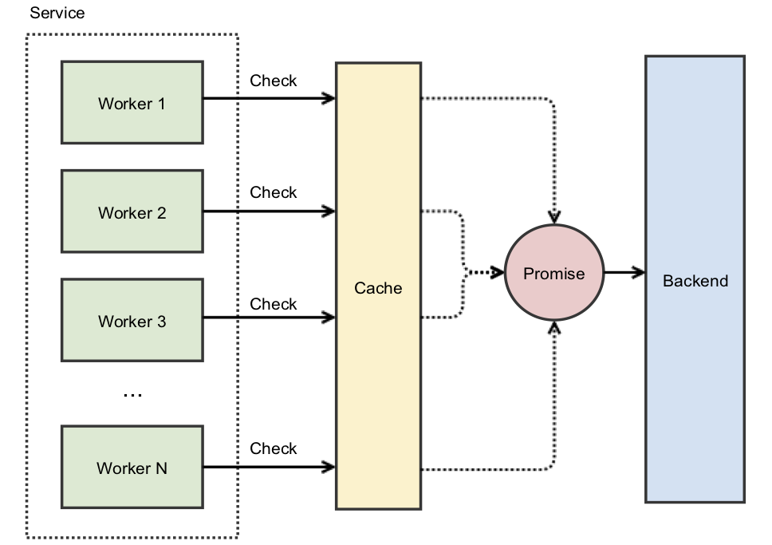

https://aphyr.com/posts/294-call-me-maybe-cassandra

. However, it could just as easily have discarded the write from the right-hand client. Without a strong external coordinator, there’s just no way to tell whose data will be preserved, and whose will be thrown away.

行锁（row-level lock） 来防止脏写

---

[Discord store messages](https://www.youtube.com/redirect?event=video_description&redir_token=QUFFLUhqbjVhY1h3bkV2cFBORW5OY2tjR2dwRG56YU5MZ3xBQ3Jtc0ttRHFCME5yRXJqWEFQTUhScDV6aUVpTlpmLWJlNHp2Ymo5WUZUUGtUam5pVmJNb3d0SWFMRmZRSWFfQXBiTXp0NGlzbnp0aDF5WC1EN3MxM0M3T1ZtSGJ0OHhzY24td1YzcUNPcklqZmtYUkxXYjVsYw&q=https%3A%2F%2Fdiscord.com%2Fblog%2Fhow-discord-stores-trillions-of-messages&v=xynXjChKkJc)

Reads are more expensive than writes

Mysql: *B+ tree* used, based on primary key, leaf pages contains records, range query

For Unclustered index: Postgre used tuple (pageid), Mysql used primary key

Write: 
appended to a commit log, commit to a **memtable**, and eventually flush to a disk

during read, need to query memtable (multiple SSTable) -> which potentially leads to a hot partition

---

[Uber](https://www.uber.com/blog/real-time-push-platform/)

## system

Redis & Apache Cassandra (replication & storage):
- Cassandra is a durable and cross region replicated storage
- Redis was used as a capacity cache on top of Cassandra to avoid thundering herd problems commonly associated with the sharded systems on deployments or failover events.

Apache Helix:
-  a robust cluster management framework that works on top of ZooKeeper
- allowing defining custom topologies and rebalancing algorithms
- uses ZooKeeper for monitoring of connected workers and propagating sharding state information change

[Thundering Herds & Promises](https://instagram-engineering.com/thundering-herds-promises-82191c8af57d)

 instead of caching the actual value, we cached a Promise that will eventually provide the value. When we use our cache atomically and get a miss, instead of going immediately to the backend we create a Promise and insert it into the cache. This new Promise then starts the work against the backend. The benefit this provides is other concurrent requests will not miss as they’ll find the existing Promise — and all these simultaneous workers will wait on the single backend request.

##  consistency

- **Network Toplogy Strategy**
- no slave / server
- eventually consistent thus all nodes across all datacenters sees the same state only after few seconds

-  consistency level:
https://www.baeldung.com/cassandra-consistency-levels

|  Consistency Level | |
| -- | -- |
| ONE | ack from one |
| QUROM | ack from 51% or a majority of replica |
|  LOCAL_QUORUM | ack within the same datacenter > 51%  |
| ALL| ack from all nodes |

❓ Strong consistency
- W + R > RF
examples:

Given Write CL = QUORUM and Read CL = QUORUM

1) If RF = 3, W = QUORUM or LOCAL_QUORUM, R = QUORUM or LOCAL_QUORUM, then W (2) + R (2) > RF (3)

2) If RF = 3, W = ALL, R = ONE, then W (3) + R (1) > RF (3)

https://www.baeldung.com/cassandra-keys
## keys

- `>= 1` partition keys - data distribution across nodes
- `>= 0` clustering key components - data sorting within the partition

((primary keys) parition keys)

keys1:keys2 are stored among nodes
cluster keys are for sorting

WHERE clause:
- define at least all primary keys
- only can query `=` equal

WITH CLUSTERING ORDER BY:
- (partition_key1 ASC, partition_key2 DESC)

in order of clustering keys setting 依照key definition 的次序

Last option for Override: Allow Filtering
- no partition key
- partition key with `!=`
- preceding clustering keys has `!=`

https://www.baeldung.com/cassandra-secondary-indexes
## secondary index

*  Regular Secondary Index 
when executing a search query using the secondary index, Cassandra reads the indexed data from every node and collects all the results. If our cluster has many nodes, this can lead to increased data transfer and high latency.

* SSTable-Attached Secondary Index (SASI)
The advantages of SASI are the tokenized text search, fast range scans, and in-memory indexing. On the other hand, a disadvantage is that it generates big index files, especially when enabling text tokenization.