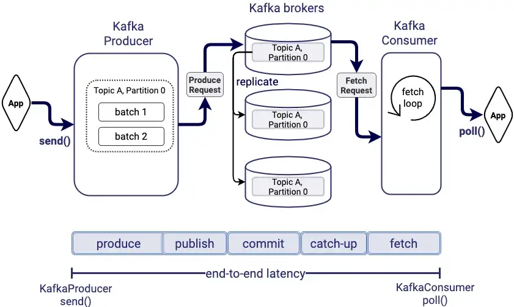
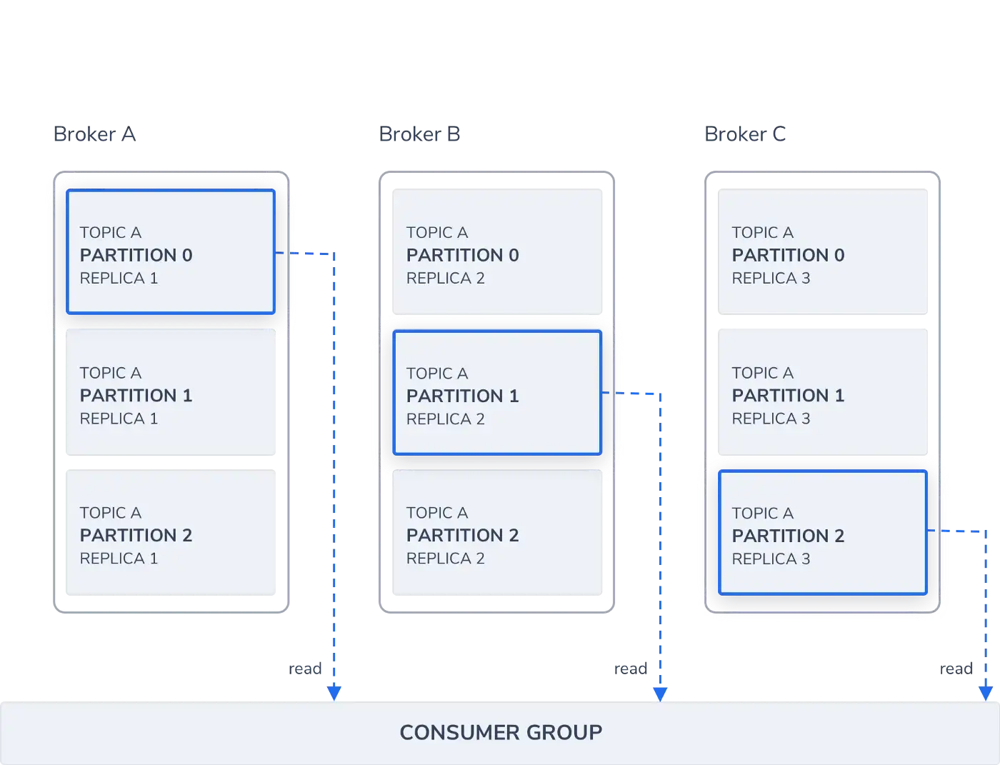

[link](https://aws.plainenglish.io/apache-kafka-system-architecture-cc74e7d47904)

## Kafka: distributed, publish/subscribe messaging system, high throughput `100k per second` & low latency `(ms)`

- de-couple
- handle burst traffic
- different speed request for produce vs. ack message
- ordering (within partition)
- persist (if needed) then delete
  

## method

- 1 to 1: process by consumer and delete
- 1 to many: publish to topic, consume by multiple consumer with offset stored in kafka server

## features

1. message persistence in `O(1)` time complexity - "log" data structure (only appends)

2. high throughput `100k per second`

3. ensuring the sequential transmission of messages

4. support online horizontal expansion

5. `ZooKeeper` coordinate and forward the requests with leader-follower concept ( asynchronously )

6. Topic & consumer: many-to-many

NOTE:

Kafka only provides a ***total order*** over messages within a partition, ***not between different partitions in a topic***

in other words,

Due to partition (within a topic): For a consumer, messages coming from a partition would always be in order but ordering of messages coming from a topic is not guaranteed.

## functions

1) publish message + subscription message

2) interdiate storage array

3) broker: grouped to manage performance

4) topics: patition across system, running in parallel to multiple consumer groups

5) partition: replicate topics for limit on fault tolerance. message has sequence ID to know the sequential order

6) producer (configurations on ): transmit data to right/round-robin partition ).

    - configurations: ****acks (ack = 0 .. all = -1 ) for no number of acks required from replicas, retries, batch size, send machanism (fire and forget, sync, async)****

    - trade-off: consistency and throughput

7) consumer: subscribe to partition with load balance

    - configurations: read time (one, at least one, at most one), auto vs. manual commit, offset strategy, heartbeat to broker, replicas of partition among brokers

8) stram workflow by *ROCKS DB*

9) Zookeeper: maintain metadata for all brokers, topics, partitions, and replicas, notify broker fail, store offset of consumer

## Usage Scenario

Log Collection

Message System

User Activity Tracking

Operational Indicators

Streaming

https://www.softkraft.co/apache-kafka-use-cases/

1) User activity tracking

"clicks, registrations, likes, time spent "

LinkedIn, Coursera: serving as the data pipeline for real-time learning analytics/dashboards with Logging user activity

2) Real-time data processing

"raw input data is consumed from Kafka topics and then aggregated, enriched, or otherwise transformed into new topics for further consumption or follow-up processing."

TikTok (ByteDance) utilizes Kafka as a data hub for the collection of events and logs

3) event streams
"Kafka Streams good for event handler. event logs, event sourcing, and stream processing"

4) Centralized Data Log

## compare with Redis

- Redis: It is used for various use cases such as **Session Cache, Full Page Cache (FPC), Leader Boards/Counting, Pub s/ Sub, Queues**

- Apache Kafka: Kafka has various use cases such as **Messaging, Website Activity Tracking, Log Aggregation, Stream Processing, Metrics, Event Sourcing, Commit log**.

- Redis: Redis supports ***push-based delivery*** of messages that means messages published to Redis will be delivered automatically to subscribers immediately.

- Apache Kafka: Kafka supports **pull-based delivery** of messages, meaning that messages published in Kafka are never distributed directly to consumers, consumers **subscribe to topics** and ask for messages when consumers are ready to deal with them.

https://engineering.linkedin.com/kafka/benchmarking-apache-kafka-2-million-writes-second-three-cheap-machines

kafka:
* persistent - messages are immediately written to the filesystem when they are received.
* high throughput - 2 m qps, Kafka topic is just a sharded write-ahead log. Producers append records to these logs
* durability: central queue for consumers, space-efficient, buffer TBs of unconsumed data

---

exactly-once semantics in Kafka:

enable idempotent producer and transactional feature on the producer by setting the unique value for “transaction.id” for each producer
enable transaction feature at the consumer by setting property “isolation.level” to value “read_committed“