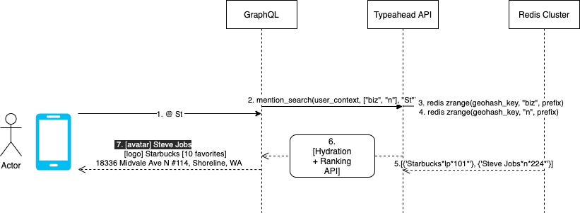

https://engblog.nextdoor.com/typeahead-search-at-nextdoor-1875e70c67e8

## search

Uber’s open source geohashing library called H3.

check on [redis](../redis.md) for using persistent redis

We used Uber’s open source geohashing library called H3.

For handling typeahead search, we decided to use sorted sets. This gives a set of benefits:

- In-memory storage gives us the best possible latency characteristics for handling typeahead search.

- It is easy to maintain. We can rely on redis persistence without having to handle durability ourselves.

- By following the Command Query Responsibility Segregation (CQRS) pattern, we are able to index hundreds of millions of entities in a matter of hours with no impact to the serving of production traffic. Ingestion is handled by redis primary nodes in the cluster, and updates are then replicated to the read-only nodes which handle the typeahead search. Replication lag is less than 10ms.

