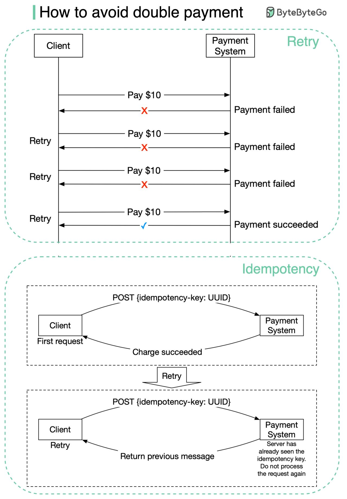
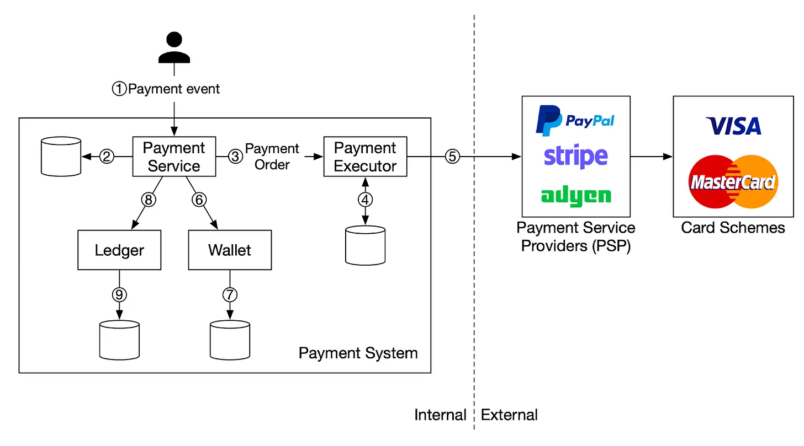
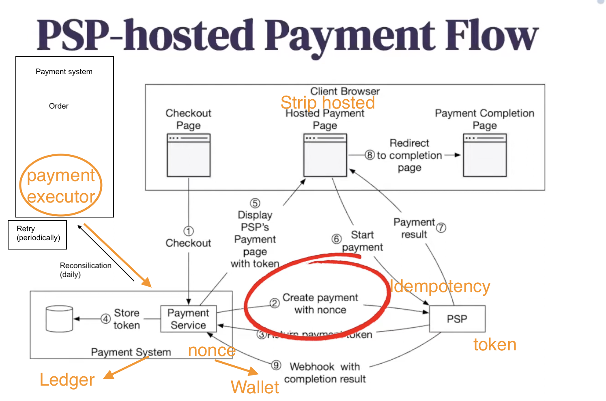

### Retry and Idempotency

idempotency

 uber有个分布式的实现，不怎么详细，airbnb有个非常详细的SQL sharding的实现

SQL sharding

https://newsletter.pragmaticengineer.com/p/designing-a-payment-system

A credit card requires extra protection like 3D Secure Authentication [13] which requires extra details from a card holder to verify a purchase.

payment request is finally completed, the PSP calls the registered webhook mentioned above.

poll the PSP for status updates on any pending payment requests. 

---

### Payment event

checkout_id
buyer_info
seller_info
card_info
status

### Payment order
payment_order_id (PK)
buyer_account
checkout_id (FK)
amount
currency
payment_status - "Not started", "executing", "proceessed"
ledger_updated
wallet_updated

---
## Non functional requirement

Exactly-once
- retry (status monitor and retry)
- < 1: idempotency key (nounce and token)

Resistence:
- reconciliation (payment sync with payment service provider)

---
## Replication

Concensus protocol （共识）:

