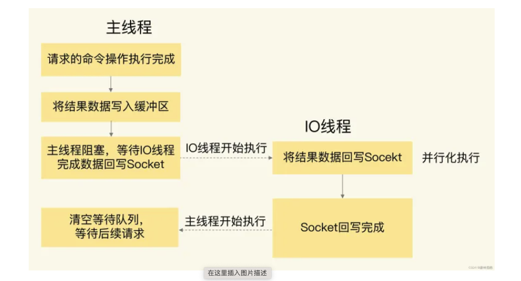

## Solution 1 
redis 6.0
阶段一：服务端和客户端建立Socket连接，并分配处理线程
主线程通过轮询方法把Socket连接分配给IO线程。

阶段二：IO线程读取并解析请求 (并行处理)
多个IO线程在并行处理
等待IO线程完成客户端请求读取和解析 

阶段三：主线程执行请求操作 (单线程 串行)

等到IO线程解析完请求，主线程还是会以单线程的方式执行这些命令操作

阶段四：IO线程回写Socket时，也是有多个线程在并发执行, 回写Socket

## Solution 2

可序列化 (Serializable)、可重复读 (Repeatable reads)、提交读 (Read committed) 和未提交读 (Read uncommitted)

“幻读”（phantom reads）: second time read - 第二次执行时所出现的行
为确保在同一事务中的两次读取会返回同样的数据，可使用可序列化事务隔离级别。可序列化使用了“范围锁”，避免了匹配 WHERE 条件的新行添加到一个开放的事务中。

